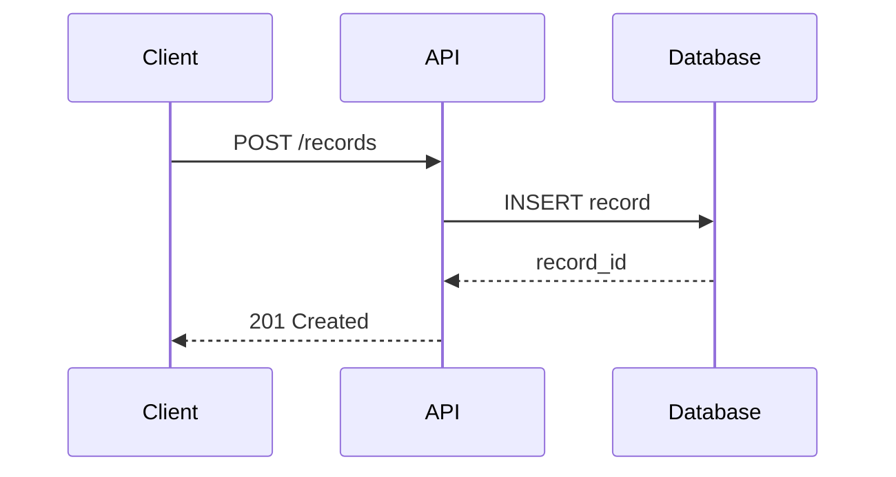

# Markdown Visualizer

## Goal

Create a more scannable Markdown document while preserving the source's facts, meaning, terminology, numbers, caveats, conclusions, and heading structure. Keep the source file unchanged.

## Workflow

1. Locate the source `.md` file, or create it from Markdown supplied by the user.
2. Read the source completely. For long documents, map headings first, then read every section.
3. Create `<source-stem>-可视化.md` next to the source unless the user specifies another output path. Never overwrite the source.
4. Make a visual inventory before editing. Classify each candidate by its primary reading task and assign it to one or, only when justified, two complementary forms:
   - prose;
   - Markdown table;
   - inline SVG data chart;
   - inline SVG relationship diagram;
   - Mermaid technical sequence diagram.
5. Transform section by section:
   - Keep prose when a visual would reduce precision or readability.
   - Use Markdown tables when the reader must look up exact values, scan many fields, or compare heterogeneous attributes.
   - Use inline SVG charts when the source contains comparable quantitative observations and the visual answers a clear question about comparison, change, composition, distribution, relationship, contribution, conversion, or progress.
   - Use inline SVG diagrams for business processes, workflows, decision paths, lifecycles, dependencies, hierarchies, architecture, state transitions, cause-effect chains, timelines, roadmaps, maturity models, loops, quadrants, layered stacks, annotated canvases, and relationship maps.
   - Use Mermaid only when the content is a technical interaction sequence as defined below.
6. For every data-chart candidate, follow the Data Chart Workflow below and read [`references/chart-selection.md`](references/chart-selection.md) completely before drawing.
7. Add lead-in text only when necessary for context. Do not add analysis, facts, examples, or recommendations absent from the source.
8. Manually review fidelity, chart integrity, accessibility, and visual readability.
9. Run `scripts/check_visualized_md.py <source.md> <output.md>` and fix all errors plus relevant warnings.

## Data Chart Workflow

1. Extract a tidy data ledger before drawing: category or time, value, unit, denominator, series, source wording, and missing-value state.
2. Identify the relationship the chart must show:
   - magnitude or rank;
   - change over time;
   - part-to-whole composition;
   - distribution or range;
   - correlation or two-variable relationship;
   - stage conversion;
   - contribution to a total;
   - actual versus target;
   - two-dimensional intensity;
   - volume moving between stages or entities.
3. Choose the chart from `references/chart-selection.md`. Prefer the simplest form that answers the question without hiding exact values.
4. Verify chart prerequisites. If the denominator, units, time basis, bins, stages, or comparable scale are missing or inconsistent, keep a table or prose instead.
5. Preserve exact values either as direct labels in the SVG or in an adjacent Markdown table. Keep the table when there are more than eight plotted observations, when precise lookup matters, or when labels would crowd the chart.
6. Label any deterministic arithmetic derived from source values as `计算值` in adjacent text or the SVG description. Do not derive estimates, interpolate missing values, or convert missing values to zero.
7. Render and visually inspect the SVG. Check scale, baseline, ordering, labels, legend, units, and bounds before proceeding.

## Chart Integrity Rules

- Use pie or donut charts only for a genuine single whole with non-negative mutually exclusive parts, a known denominator, and no more than six slices. Ensure displayed shares total approximately 100% after stated rounding. Otherwise use bars or a 100% stacked bar.
- Start quantitative bar axes at zero. If the source requires a non-zero baseline, switch to a dot, range, or line chart and label the scale explicitly.
- Use line charts only for ordered time or continuous sequences. Do not connect unordered categories.
- Use stacked bars only when both total and composition matter. Use grouped bars for direct cross-series comparison and 100% stacked bars for proportional composition.
- Use funnels only for sequential stages measured from a common cohort. Do not use a funnel for an ordinary process or unordered categories.
- Use scatter or bubble charts only when paired observations exist. Describe association, not causation, unless the source explicitly supports causality.
- Use histograms or box plots only when the source provides raw observations, bins, or the required summary statistics. Do not invent a distribution.
- Use heatmaps only when both axes are categorical or ordered dimensions with comparable cell values. Always show the scale or value labels.
- Use waterfall charts only when signed contributions reconcile to a stated start, subtotal, or end value.
- Avoid 3D charts, decorative gauges, radar charts, dual-axis charts, and area-scaled pictograms unless the user explicitly requests them and the encoding can be made truthful.
- Keep source order when it is meaningful. Sort bars only when the source does not encode a sequence, hierarchy, or mandated order.
- Preserve units, bases, time windows, denominators, ranges, uncertainty, and qualifiers. Never imply that `N/A`, blank, unknown, or not measured equals zero or any other magnitude. Leave its data-mark position empty and place the missing-state label outside the plot area—beside the category label, in the subtitle/caption, or in the adjacent table.
- Do not add trend lines, targets, averages, benchmarks, thresholds, or annotations unless they are present in the source or are explicitly labeled deterministic calculations.

## Mermaid Hard Boundary

Use Mermaid only when both conditions are true:

1. The diagram shows chronological messages, calls, events, callbacks, acknowledgements, timeouts, or responses.
2. The participants are technical actors such as clients, services, APIs, agents, databases, queues, browsers, or infrastructure components.

Use only Mermaid `sequenceDiagram`. Do not use Mermaid `flowchart`, `graph`, `timeline`, `stateDiagram`, `classDiagram`, `journey`, `gantt`, or other diagram types.

Business handoffs, operating procedures, user journeys, approval flows, maturity stages, causal chains, and ordinary chronological timelines are not technical sequence diagrams; render them as SVG.



## SVG Rules

Before generating SVG, read [`references/svg-style.md`](references/svg-style.md) completely and follow it unless the user supplies a different visual system. When drawing a quantitative chart, also read [`references/chart-selection.md`](references/chart-selection.md) completely.

- Embed SVG directly in Markdown; do not rasterize it.
- Make each SVG self-contained and responsive through `viewBox`.
- Keep the SVG canvas transparent. Do not add a full-canvas background rectangle or use the former light-gray canvas fill `#f8fafc`.
- Include `role="img"`, `aria-label`, `<title>`, and `<desc>`.
- Give every marker and reusable definition a document-unique ID.
- Use `<text>` and `<tspan>` with explicit line breaks. Do not use `foreignObject`.
- Avoid remote assets, scripts, filters, masks, clip paths, gradients, and features likely to fail during Feishu/Lark whiteboard conversion.
- For data charts, include units, scales, legends or direct labels, and a description that states the represented dimensions and values or points to the adjacent exact-value table.
- Check text wrapping, arrow direction, chart scale, label overlap, contrast, and canvas bounds by rendering or previewing the SVG.

Minimal structure:

```html
<svg xmlns="http://www.w3.org/2000/svg" viewBox="0 0 1000 520" role="img" aria-label="图示说明">
  <title>图示标题</title>
  <desc>用一句话完整说明关系、顺序或结论。</desc>
  <!-- cards, labels, connectors -->
</svg>
```

## Fidelity Rules

- Do not summarize away source content. If a visual replaces prose, every material point must remain in the visual or adjacent text.
- Do not change numeric values, dates, names, proper nouns, policy statements, requirements, rankings, constraints, or causal relationships.
- Do not invent categories merely to make a table or diagram tidy.
- Do not invent data points, denominators, bins, baselines, series, targets, or totals to make a chart possible.
- Do not translate unless explicitly asked.
- Preserve heading hierarchy unless a small local adjustment is necessary for navigation.
- Prefer exact source wording. Shorten labels only when the meaning is unchanged.
- Preserve ambiguity instead of resolving it.
- Do not turn a qualified claim into a definitive one.

## Output Checklist

- Output filename ends with `-可视化.md`.
- Source exists and is byte-for-byte unchanged.
- Important source headings and links remain present.
- Every visualization is supported by source content.
- Every chart has a clear reading question, valid prerequisites, labeled units, and exact values in the SVG or an adjacent table.
- Pie/donut shares use one denominator and total approximately 100%; funnels use a common cohort; waterfalls reconcile.
- Missing values remain missing, and deterministic derived values are marked `计算值`.
- Every Mermaid block begins with `sequenceDiagram` and represents a technical interaction sequence.
- Every other diagram is inline SVG following `references/svg-style.md`.
- Every SVG contains `role="img"`, `aria-label`, `<title>`, and `<desc>`.
- Every SVG has a transparent canvas with no full-canvas background rectangle and no `#f8fafc` fill.
- SVGs have been parsed and visually previewed where tooling allows.
- `scripts/check_visualized_md.py` completes without errors.
- Final response reports the output path and any validation caveats.

## Validation

```bash
python3 .agents/skills/markdown-visualizer/scripts/check_visualized_md.py \
  source.md \
  source-可视化.md
```

The checker enforces naming, heading preservation, SVG accessibility and compatibility markers, and the Mermaid sequence-only boundary. It cannot judge whether a chart's denominator, scale, or semantic choice is truthful, so verify chart integrity manually.
